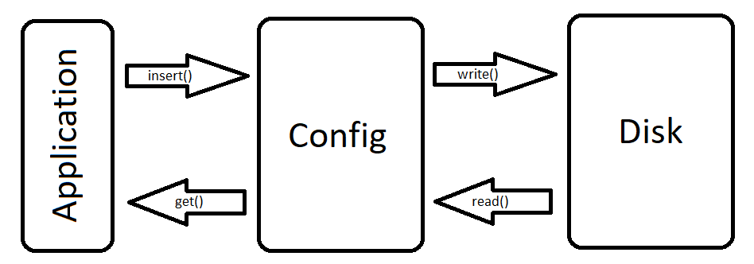

# system-config
A Rust library for storing application properties on disk in any context and between restarts.

# Example
Add key-value pairs to the config and write it to disk...
```rust
let mut config = Config::new("system-config-example").unwrap();

config.insert("key1", "value1");
config.insert("key2", "value2");

config.write().unwrap();
```

Then retrieve the information at any other time, even after the application is restarted or in different contexts.
```rust
let config = Config::new("system-config-example").unwrap();

let key1 = config.get("key1").unwrap();
let key2 = config.get("key2").unwrap();

println!("key1: {}", key1);
println!("key2: {}", key2);
```

To demonstrate this I've created a few examples that do this exact thing.
```
$ cargo run -q --example write
$ cargo run -q --example read
key1: value1
key2: value2
$ cargo run -q --example clear
$ cargo run -q --example read
thread 'main' panicked at 'called `Option::unwrap()` on a `None` value', examples/read.rs:6:35
note: run with `RUST_BACKTRACE=1` environment variable to display a backtrace
```

# Structure
Internally, `system-config` is basically an abstraction over `HashMap`, which reads and writes its information to disk in yaml format on each `.read()` and `.write()`.

The file is written in a .yaml format inside of your config directory, as found by the [`dirs`](https://crates.io/crates/dirs) crate.



# License
```
MIT License

Copyright (c) 2021 Grant Handy

Permission is hereby granted, free of charge, to any person obtaining a copy
of this software and associated documentation files (the "Software"), to deal
in the Software without restriction, including without limitation the rights
to use, copy, modify, merge, publish, distribute, sublicense, and/or sell
copies of the Software, and to permit persons to whom the Software is
furnished to do so, subject to the following conditions:

The above copyright notice and this permission notice shall be included in all
copies or substantial portions of the Software.

THE SOFTWARE IS PROVIDED "AS IS", WITHOUT WARRANTY OF ANY KIND, EXPRESS OR
IMPLIED, INCLUDING BUT NOT LIMITED TO THE WARRANTIES OF MERCHANTABILITY,
FITNESS FOR A PARTICULAR PURPOSE AND NONINFRINGEMENT. IN NO EVENT SHALL THE
AUTHORS OR COPYRIGHT HOLDERS BE LIABLE FOR ANY CLAIM, DAMAGES OR OTHER
LIABILITY, WHETHER IN AN ACTION OF CONTRACT, TORT OR OTHERWISE, ARISING FROM,
OUT OF OR IN CONNECTION WITH THE SOFTWARE OR THE USE OR OTHER DEALINGS IN THE
SOFTWARE.
```
